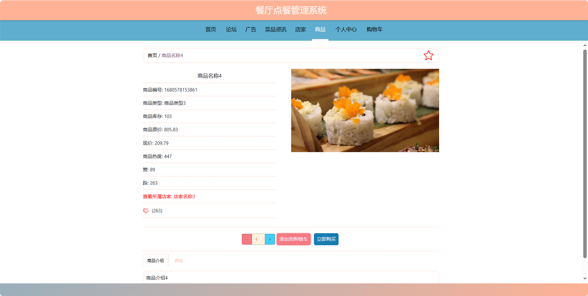

基于Springboot的餐厅点餐管理系统（程序+论文）
=
### 完整代码获取地址：从戎源码网 ([https://armycodes.com/](https://armycodes.com/))
### 作者微信：19941326836  QQ：952045282 
### 承接计算机毕业设计、Java毕业设计、Python毕业设计、深度学习、机器学习
### 选题+开题报告+任务书+程序定制+安装调试+论文+答辩ppt 一条龙服务
### 所有选题地址https://github.com/nature924/allProject

一、项目介绍
---
基于Spring Boot框架实现的餐厅点餐管理系统，系统包含三种角色：管理员、用户，店家,系统分为前台和管理员后台，店家后台两大模块，主要功能如下。

### 【前台功能】

1. 首页：提供用户进入系统的入口，展示餐厅的整体概况和最新信息。
2. 论坛：用户可以在论坛上进行关于餐厅的讨论和交流。
3. 广告：展示餐厅的广告信息，包括优惠活动、新菜品推荐等。
4. 菜品资讯：提供关于菜品的详细信息，包括口味、原料等。
5. 店家：展示餐厅的信息，包括位置、联系方式等。
6. 商品：用户可以浏览并选择餐厅提供的商品。
7. 个人中心：用户可以管理个人信息，包括修改密码、更新个人资料等。
8. 购物车：用户可以查看已选商品，进行加减数量或删除操作。

### 【管理员后台功能】

1. 首页：提供管理员进入后台管理的入口。
2. 个人中心：管理员可以管理个人信息。
3. 管理员管理：添加、编辑、删除系统管理员账号。
4. 店家管理：添加、编辑、删除店家账号。
5. 用户管理：查看、编辑、冻结或删除用户账号。
7. 广告管理：发布、编辑、删除餐厅的广告信息。
8. 基础数据管理：管理系统的基础数据，
9. 论坛管理：管理论坛板块
10. 菜品资讯管理：发布、编辑、删除有关菜品的资讯。
11. 轮播图信息：管理员可以设置首页轮播图

### 【店家后台功能】

1. 首页：提供店家进入后台管理的入口
2. 个人中心：店家可以管理个人信息
3. 商品管理：店家可以添加、编辑、删除商品信息。
4. 广告管理：店家可以发布、编辑、删除餐厅的广告信息。
5. 论坛管理：店家负责论坛板块的管理。
6. 菜品资讯管理：店家可以发布、编辑、删除有关菜品的资讯。

二、项目技术
---
- 编程语言：Java
- 数据库：MySQL
- 项目管理工具：Maven
- 前端技术：VUE、HTML、Jquery、Bootstrap
- 后端技术：Spring、SpringMVC、MyBatis

三、运行环境
---
- 操作系统：Windows、macOS都可以
- JDK版本：JDK1.8以上都可以
- 开发工具：IDEA、Ecplise、Myecplise都可以
- 数据库: MySQL5.7以上都可以
- Tomcat：任意版本都可以
- Maven：任意版本都可以

四、运行截图
---
### 论文截图：

### 程序截图：

